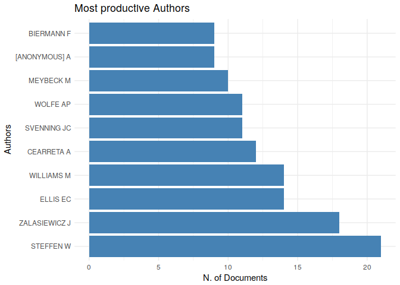
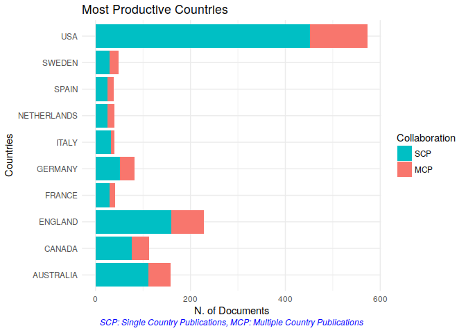
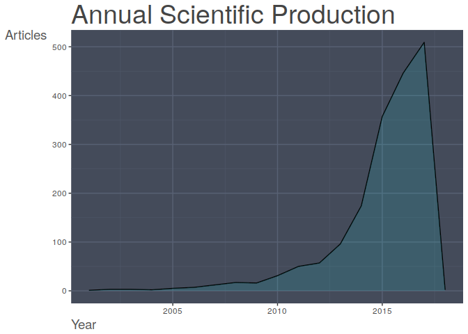
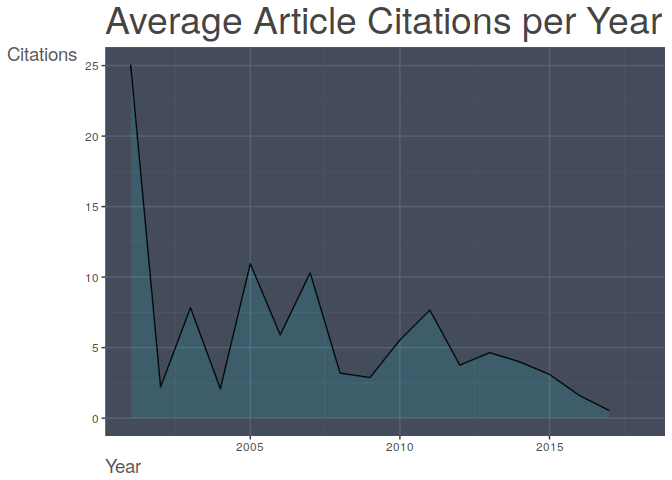
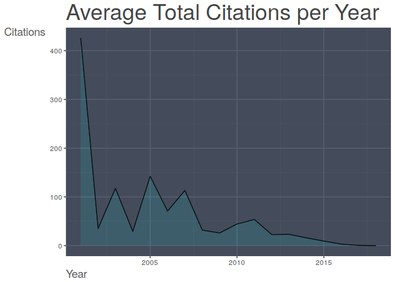
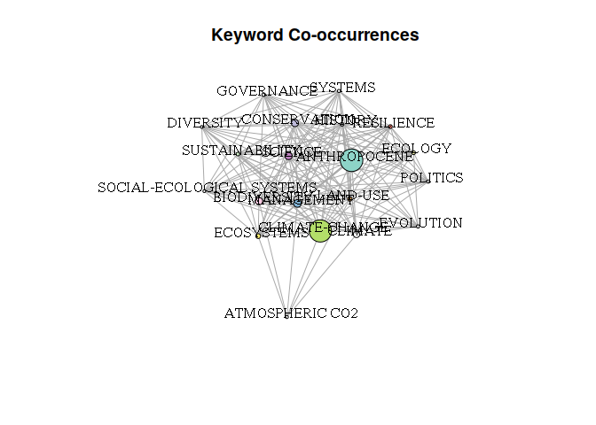
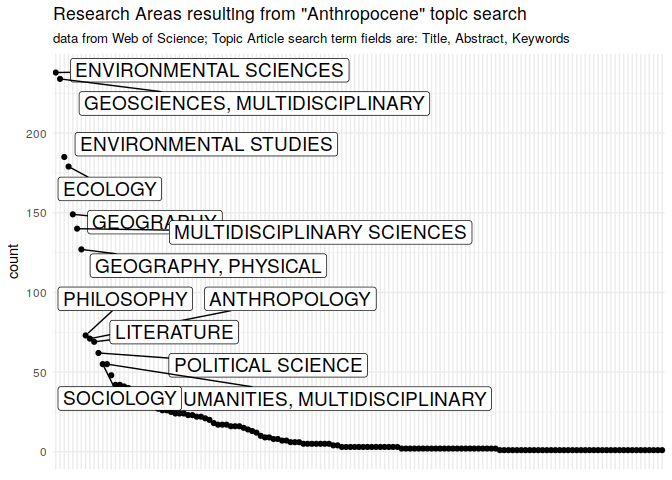

Data was downloaded on Di 19. Dez 11:51:54 CET 2017 from [Web of
Science](http://apps.webofknowledge.com/summary.do?product=WOS&search_mode=GeneralSearch&qid=1&SID=F2uyu8Tz33gg81ezRRV&page=)
using query "anthropocene"

bibliometric analyses
=====================

Data preparation and reshaping is conducted using the `bibliometrix`
package (Aria and Cuccurullo 2017).

    library(magrittr)
    ## devtools::install_github("massimoaria/bibliometrix")
    library(bibliometrix)

    ## To cite bibliometrix in publications, please use:
    ## 
    ## Aria, M. & Cuccurullo, C. (2017) bibliometrix: An R-tool for comprehensive science mapping analysis, Journal of Informetrics, 11(4), pp 959-975, Elsevier.
    ## 
    ## http:\\www.bibliometrix.org

    raw_data <- readFiles("./data/wos_query_anthropocene/wos_anthropocene_topic_1.bib",
                          "./data/wos_query_anthropocene/wos_anthropocene_topic_2.bib",
                          "./data/wos_query_anthropocene/wos_anthropocene_topic_3.bib",
                          "./data/wos_query_anthropocene/wos_anthropocene_topic_4.bib")
    raw_df <- convert2df(file = raw_data, dbsource = "isi", format = "bibtex")

    ## Articles extracted   100 
    ## Articles extracted   200 
    ## Articles extracted   300 
    ## Articles extracted   400 
    ## Articles extracted   500 
    ## Articles extracted   600 
    ## Articles extracted   700 
    ## Articles extracted   800 
    ## Articles extracted   900 
    ## Articles extracted   1000 
    ## Articles extracted   1100 
    ## Articles extracted   1200 
    ## Articles extracted   1300 
    ## Articles extracted   1400 
    ## Articles extracted   1500 
    ## Articles extracted   1600 
    ## Articles extracted   1700 
    ## Articles extracted   1788

    results <- biblioAnalysis(raw_df, sep = ";")

    summary(object = results, k = 10, pause = FALSE)

    ## 
    ## 
    ## Main Information about data
    ## 
    ##  Articles                              1788 
    ##  Sources (Journals, Books, etc.)       720 
    ##  Keywords Plus (ID)                    4023 
    ##  Author's Keywords (DE)                4051 
    ##  Period                                2001 - 2018 
    ##  Average citations per article         11.08 
    ## 
    ##  Authors                               4518 
    ##  Author Appearances                    5725 
    ##  Authors of single authored articles   654 
    ##  Authors of multi authored articles    3864 
    ## 
    ##  Articles per Author                   0.396 
    ##  Authors per Article                   2.53 
    ##  Co-Authors per Articles               3.2 
    ##  Collaboration Index                   4.35 
    ##  
    ## 
    ## Annual Scientific Production
    ## 
    ##  Year    Articles
    ##     2001        1
    ##     2002        3
    ##     2003        3
    ##     2004        2
    ##     2005        5
    ##     2006        7
    ##     2007       12
    ##     2008       17
    ##     2009       16
    ##     2010       31
    ##     2011       50
    ##     2012       57
    ##     2013       96
    ##     2014      174
    ##     2015      357
    ##     2016      446
    ##     2017      509
    ##     2018        2
    ## 
    ## Annual Percentage Growth Rate 4.161601 
    ## 
    ## 
    ## Most Productive Authors
    ## 
    ##    Authors        Articles Authors        Articles Fractionalized
    ## 1   STEFFEN W           21  [ANONYMOUS] A                    9.00
    ## 2   ZALASIEWICZ J       18  DALBY S                          8.20
    ## 3   ELLIS EC            14  CASTREE N                        8.05
    ## 4   WILLIAMS M          14  YUSOFF K                         6.83
    ## 5   CEARRETA A          12  CLARK N                          6.50
    ## 6   SVENNING JC         11  MEYBECK M                        5.63
    ## 7   WOLFE AP            11  LORIMER J                        5.00
    ## 8   MEYBECK M           10  SKLAIR L                         5.00
    ## 9   [ANONYMOUS] A        9  THOMAS CD                        5.00
    ## 10  BIERMANN F           9  CRUTZEN PJ                       4.33
    ## 
    ## 
    ## Top manuscripts per citations
    ## 
    ##                                                                                                                                                                                                                                                                                                              Paper         
    ## 1  STEFFEN W;CRUTZEN PJ;MCNEILL JR,(2007),AMBIO                                                                                                                                                                                                                                                                            
    ## 2  SMOL JP;WOLFE AP;BIRKS HJB;DOUGLAS MSV;JONES VJ;KORHOLA A;PIENITZ R;RUHLAND K;SORVARI S;ANTONIADES D;BROOKS SJ;FALLU MA;HUGHES M;KEATLEY BE;LAING TE;MICHELUTTI N;NAZAROVA L;NYMAN M;PATERSON AM;PERREN B;QUINLAN R;RAUTIO M;SAULNIER-TALBOT E;SIITONEN S;SOLOVIEVA N;WECKSTROM J,(2005),PROC. NATL. ACAD. SCI. U. S. A.
    ## 3  CODISPOTI LA;BRANDES JA;CHRISTENSEN JP;DEVOL AH;NAQVI SWA;PAERL HW;YOSHINARI T,(2001),SCI. MAR.                                                                                                                                                                                                                         
    ## 4  DIRZO R;YOUNG HS;GALETTI M;CEBALLOS G;ISAAC NJB;COLLEN B,(2014),SCIENCE                                                                                                                                                                                                                                                 
    ## 5  STEFFEN W;GRINEVALD J;CRUTZEN P;MCNEILL J,(2011),PHILOS. TRANS. R. SOC. A-MATH. PHYS. ENG. SCI.                                                                                                                                                                                                                         
    ## 6  RABALAIS NN;DIAZ RJ;LEVIN LA;TURNER RE;GILBERT D;ZHANG J,(2010),BIOGEOSCIENCES                                                                                                                                                                                                                                          
    ## 7  STEFFEN W;PERSSON A;DEUTSCH L;ZALASIEWICZ J;WILLIAMS M;RICHARDSON K;CRUMLEY C;CRUTZEN P;FOLKE C;GORDON L;MOLINA M;RAMANATHAN V;ROCKSTROM J;SCHEFFER M;SCHELLNHUBER HJ;SVEDIN U,(2011),AMBIO                                                                                                                             
    ## 8  GRIGGS D;STAFFORD-SMITH M;GAFFNEY O;ROCKSTROEM J;OEHMAN MC;SHYAMSUNDAR P;STEFFEN W;GLASER G;KANIE N;NOBLE I,(2013),NATURE                                                                                                                                                                                               
    ## 9  GOLDEWIJK KK;BEUSEN A;VAN DRECHT G;DE   VOS M,(2011),GLOB. ECOL. BIOGEOGR.                                                                                                                                                                                                                                              
    ## 10 ZALASIEWICZ J;WILLIAMS M;STEFFEN W;CRUTZEN P,(2010),ENVIRON. SCI. TECHNOL.                                                                                                                                                                                                                                              
    ##     TC TCperYear
    ## 1  665      60.5
    ## 2  485      37.3
    ## 3  426      25.1
    ## 4  416     104.0
    ## 5  388      55.4
    ## 6  328      41.0
    ## 7  307      43.9
    ## 8  300      60.0
    ## 9  270      38.6
    ## 10 256      32.0
    ## 
    ## 
    ## Most Productive Countries (of corresponding authors)
    ## 
    ##      Country   Articles   Freq SCP MCP
    ## 1  USA              573 0.3379 452 121
    ## 2  ENGLAND          228 0.1344 160  68
    ## 3  AUSTRALIA        158 0.0932 112  46
    ## 4  CANADA           113 0.0666  77  36
    ## 5  GERMANY           82 0.0483  52  30
    ## 6  SWEDEN            48 0.0283  30  18
    ## 7  FRANCE            41 0.0242  29  12
    ## 8  ITALY             40 0.0236  32   8
    ## 9  NETHERLANDS       40 0.0236  25  15
    ## 10 SPAIN             39 0.0230  25  14
    ## 
    ## 
    ## SCP: Single Country Publications
    ## 
    ## MCP: Multiple Country Publications
    ## 
    ## 
    ## Total Citations per Country
    ## 
    ##       Country      Total Citations Average Article Citations
    ## 1  USA                        6868                     11.99
    ## 2  AUSTRALIA                  3035                     19.21
    ## 3  ENGLAND                    2759                     12.10
    ## 4  CANADA                     1313                     11.62
    ## 5  GERMANY                    1006                     12.27
    ## 6  NETHERLANDS                 759                     18.98
    ## 7  FRANCE                      729                     17.78
    ## 8  CHINA                       551                     16.21
    ## 9  SWEDEN                      518                     10.79
    ## 10 ITALY                       312                      7.80
    ## 
    ## 
    ## Most Relevant Sources
    ## 
    ##                                                                       Sources       
    ## 1  ANTHROPOCENE                                                                     
    ## 2  HOLOCENE                                                                         
    ## 3  PROCEEDINGS OF THE NATIONAL ACADEMY OF SCIENCES OF THE UNITED STATES OF   AMERICA
    ## 4  SCIENCE                                                                          
    ## 5  QUATERNARY SCIENCE REVIEWS                                                       
    ## 6  NATURE                                                                           
    ## 7  ECOLOGY AND SOCIETY                                                              
    ## 8  THEORY CULTURE \\& SOCIETY                                                       
    ## 9  CURRENT OPINION IN ENVIRONMENTAL SUSTAINABILITY                                  
    ## 10 ENVIRONMENTAL HUMANITIES                                                         
    ##    Articles
    ## 1        34
    ## 2        32
    ## 3        23
    ## 4        21
    ## 5        20
    ## 6        18
    ## 7        17
    ## 8        17
    ## 9        16
    ## 10       15
    ## 
    ## 
    ## Most Relevant Keywords
    ## 
    ##    Author Keywords (DE)      Articles Keywords-Plus (ID)     Articles
    ## 1             ANTHROPOCENE        539         ANTHROPOCENE        327
    ## 2             CLIMATE CHANGE      149         CLIMATE-CHANGE      267
    ## 3             BIODIVERSITY         45         CLIMATE             100
    ## 4             SUSTAINABILITY       39         SCIENCE              96
    ## 5             ECOLOGY              38         MANAGEMENT           93
    ## 6             HOLOCENE             35         BIODIVERSITY         85
    ## 7             CONSERVATION         30         CONSERVATION         83
    ## 8             RESILIENCE           28         ECOSYSTEMS           55
    ## 9             GLOBAL CHANGE        27         HISTORY              54
    ## 10            CLIMATE              25         ECOLOGY              53

    plot(x = results, k = 10, pause = FALSE)

    ## Warning: Removed 1 rows containing missing values (position_stack).

    ## Warning: Removed 1 rows containing missing values (geom_path).

    # Create keyword co-occurrencies network
    NetMatrix <- biblioNetwork(M = raw_df, analysis = "co-occurrences", network = "keywords", sep = ";")
    # Plot the network
    net <- networkPlot(NetMatrix, n = 20, Title = "Keyword Co-occurrences", type = "kamada", size=T)

    library(magrittr)
    library(dplyr)

    ## 
    ## Attaching package: 'dplyr'

    ## The following objects are masked from 'package:stats':
    ## 
    ##     filter, lag

    ## The following objects are masked from 'package:base':
    ## 
    ##     intersect, setdiff, setequal, union

    library(readr)
    wok_field_tags <- read_tsv("data/wos_tags.txt", skip = 1)

    ## Parsed with column specification:
    ## cols(
    ##   Tag = col_character(),
    ##   Description = col_character()
    ## )

    wok_field_tags %>%
      filter(Tag == "SC")

    ## # A tibble: 1 x 2
    ##   Tag   Description   
    ##   <chr> <chr>         
    ## 1 SC    Research Areas

    library(tidyr)

    ## 
    ## Attaching package: 'tidyr'

    ## The following object is masked from 'package:magrittr':
    ## 
    ##     extract

    raw_tbl <- as.tbl(raw_df)

    ResearchArea <- raw_tbl %>%  
      mutate(SC = strsplit(as.character(SC), ";")) %>%  
      unnest %>%
      mutate(SC = trimws(x = SC, which = "left")) %>%  
      mutate(SC = as.factor(SC)) %>%
      group_by(SC) %>%
      summarise(count = n()) %>%
      arrange(desc(count))

    library(ggplot2)
    library(ggrepel)

    ra_plot <- ResearchArea %>%
      na.omit %>%  
      mutate(SC = factor(SC, levels = SC[rev(order(count))])) %>%  
      ggplot(mapping = aes(x = SC,y = count)) +
      geom_point() +
      theme_minimal() +  
      theme(axis.title.x=element_blank(),
            axis.text.x=element_blank(),
            axis.ticks.x=element_blank()) + 
      geom_label_repel(
        data = subset(x = ResearchArea, subset = ResearchArea$count > 50),
        aes(label = SC),
        size = 5,
        box.padding = 0.25,
        point.padding = 0.3
      ) + 
      labs(title = "Research Areas resulting from \"Anthropocene\" topic search",
           subtitle = "data from Web of Science; Topic Article search term fields are: Title, Abstract, Keywords")
    ra_plot

    ggsave(filename = "ResearchArea_plot.png",
           plot = ra_plot,
           scale = 2,
           width = 15,
           height = 10,
           dpi = 300,
           device = "png",
           units = "cm")

References
==========

Aria, Massimo, and Corrado Cuccurullo. 2017. “Bibliometrix: An R-Tool
for Comprehensive Science Mapping Analysis.” *Journal of Informetrics*
11 (4). Elsevier: 959–75. <https://doi.org/10.1016/j.joi.2017.08.007>.

Colophon
========

    devtools::session_info()

    ## Session info -------------------------------------------------------------

    ##  setting  value                       
    ##  version  R version 3.4.4 (2018-03-15)
    ##  system   x86_64, linux-gnu           
    ##  ui       X11                         
    ##  language en_US:en                    
    ##  collate  en_US.UTF-8                 
    ##  tz       Europe/Berlin               
    ##  date     2018-04-14

    ## Packages -----------------------------------------------------------------

    ##  package       * version    date      
    ##  assertthat      0.2.0      2017-04-11
    ##  backports       1.1.2      2017-12-13
    ##  base          * 3.4.4      2018-03-15
    ##  bibliometrix  * 1.9.2      2018-03-28
    ##  bindr           0.1.1      2018-03-13
    ##  bindrcpp      * 0.2.2.9000 2018-04-09
    ##  cli             1.0.0      2017-11-05
    ##  cluster         2.0.6      2017-03-16
    ##  colorspace      1.3-2      2016-12-14
    ##  compiler        3.4.4      2018-03-15
    ##  crayon          1.3.4      2017-09-16
    ##  datasets      * 3.4.4      2018-03-15
    ##  devtools        1.13.5     2018-02-18
    ##  digest          0.6.15     2018-01-28
    ##  dplyr         * 0.7.4.9004 2018-04-10
    ##  evaluate        0.10.1     2017-06-24
    ##  factoextra      1.0.5.999  2017-12-19
    ##  FactoMineR      1.39       2017-11-10
    ##  flashClust      1.01-2     2012-08-21
    ##  ggplot2       * 2.2.1      2016-12-30
    ##  ggrepel       * 0.7.0      2017-09-29
    ##  glue            1.2.0      2017-10-29
    ##  graphics      * 3.4.4      2018-03-15
    ##  grDevices     * 3.4.4      2018-03-15
    ##  grid            3.4.4      2018-03-15
    ##  gtable          0.2.0      2016-02-26
    ##  hms             0.4.2      2018-03-10
    ##  htmltools       0.3.6      2017-04-28
    ##  httr            1.3.1      2017-08-20
    ##  igraph          1.2.1      2018-03-10
    ##  knitr           1.20       2018-02-20
    ##  labeling        0.3        2014-08-23
    ##  lattice         0.20-35    2017-03-25
    ##  lazyeval        0.2.1      2017-10-29
    ##  leaps           3.0        2017-01-10
    ##  magrittr      * 1.5        2014-11-22
    ##  MASS            7.3-49     2018-02-23
    ##  Matrix          1.2-12     2017-11-16
    ##  memoise         1.1.0      2017-04-21
    ##  methods       * 3.4.4      2018-03-15
    ##  munsell         0.4.3      2016-02-13
    ##  parallel        3.4.4      2018-03-15
    ##  pillar          1.2.1      2018-02-27
    ##  pkgconfig       2.0.1      2017-03-21
    ##  plyr            1.8.4      2016-06-08
    ##  purrr           0.2.4      2017-10-18
    ##  R6              2.2.2      2017-06-17
    ##  RColorBrewer    1.1-2      2014-12-07
    ##  Rcpp            0.12.16    2018-03-13
    ##  readr         * 1.1.1      2017-05-16
    ##  RISmed          2.1.7      2017-06-06
    ##  rlang           0.2.0.9001 2018-04-09
    ##  rmarkdown       1.9        2018-03-01
    ##  rprojroot       1.3-2      2018-01-03
    ##  rscopus         0.5.3      2017-10-11
    ##  scales          0.5.0.9000 2017-08-30
    ##  scatterplot3d   0.3-41     2018-03-14
    ##  SnowballC       0.5.1      2014-08-09
    ##  stats         * 3.4.4      2018-03-15
    ##  stringdist      0.9.4.7    2018-03-13
    ##  stringi         1.1.7      2018-03-12
    ##  stringr         1.3.0      2018-02-19
    ##  tibble          1.4.2      2018-01-22
    ##  tidyr         * 0.8.0      2018-01-29
    ##  tidyselect      0.2.4      2018-02-26
    ##  tools           3.4.4      2018-03-15
    ##  utf8            1.1.3      2018-01-03
    ##  utils         * 3.4.4      2018-03-15
    ##  withr           2.1.2      2018-03-15
    ##  yaml            2.1.18     2018-03-08
    ##  source                                
    ##  CRAN (R 3.4.0)                        
    ##  CRAN (R 3.4.4)                        
    ##  local                                 
    ##  CRAN (R 3.4.4)                        
    ##  CRAN (R 3.4.4)                        
    ##  Github (krlmlr/bindrcpp@bd5ae73)      
    ##  CRAN (R 3.4.2)                        
    ##  CRAN (R 3.4.2)                        
    ##  cran (@1.3-2)                         
    ##  local                                 
    ##  CRAN (R 3.4.2)                        
    ##  local                                 
    ##  CRAN (R 3.4.3)                        
    ##  cran (@0.6.15)                        
    ##  Github (tidyverse/dplyr@bfc9b28)      
    ##  CRAN (R 3.4.1)                        
    ##  Github (kassambara/factoextra@e76c5bb)
    ##  CRAN (R 3.4.2)                        
    ##  CRAN (R 3.4.2)                        
    ##  CRAN (R 3.4.3)                        
    ##  cran (@0.7.0)                         
    ##  cran (@1.2.0)                         
    ##  local                                 
    ##  local                                 
    ##  local                                 
    ##  cran (@0.2.0)                         
    ##  CRAN (R 3.4.4)                        
    ##  CRAN (R 3.4.0)                        
    ##  CRAN (R 3.4.1)                        
    ##  CRAN (R 3.4.4)                        
    ##  CRAN (R 3.4.3)                        
    ##  CRAN (R 3.4.3)                        
    ##  CRAN (R 3.4.2)                        
    ##  cran (@0.2.1)                         
    ##  CRAN (R 3.4.2)                        
    ##  CRAN (R 3.4.3)                        
    ##  CRAN (R 3.4.3)                        
    ##  CRAN (R 3.4.2)                        
    ##  CRAN (R 3.4.0)                        
    ##  local                                 
    ##  cran (@0.4.3)                         
    ##  local                                 
    ##  CRAN (R 3.4.4)                        
    ##  cran (@2.0.1)                         
    ##  cran (@1.8.4)                         
    ##  cran (@0.2.4)                         
    ##  cran (@2.2.2)                         
    ##  CRAN (R 3.4.3)                        
    ##  cran (@0.12.16)                       
    ##  CRAN (R 3.4.0)                        
    ##  CRAN (R 3.4.4)                        
    ##  Github (tidyverse/rlang@9c0637a)      
    ##  CRAN (R 3.4.3)                        
    ##  CRAN (R 3.4.4)                        
    ##  cran (@0.5.3)                         
    ##  Github (hadley/scales@d767915)        
    ##  CRAN (R 3.4.4)                        
    ##  cran (@0.5.1)                         
    ##  local                                 
    ##  CRAN (R 3.4.4)                        
    ##  CRAN (R 3.4.3)                        
    ##  cran (@1.3.0)                         
    ##  cran (@1.4.2)                         
    ##  cran (@0.8.0)                         
    ##  cran (@0.2.4)                         
    ##  local                                 
    ##  cran (@1.1.3)                         
    ##  local                                 
    ##  CRAN (R 3.4.4)                        
    ##  CRAN (R 3.4.4)
