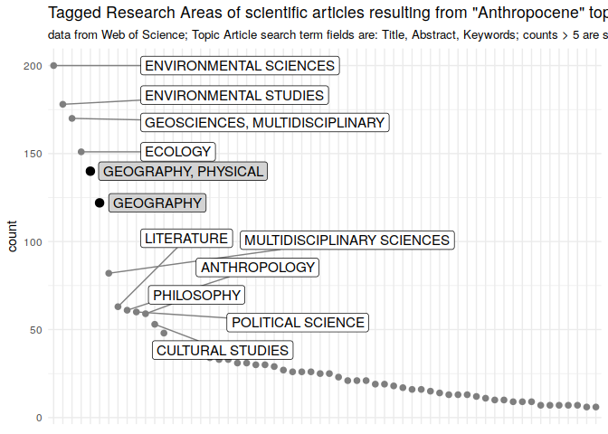

Data was downloaded on Tue Apr 24 2018 from [Web of
Science](http://apps.webofknowledge.com/summary.do?product=WOS&search_mode=GeneralSearch&qid=1&SID=F2uyu8Tz33gg81ezRRV&page=)
using advanced search and the query "TS=anthropocene". TS is the Web of
Science tag for "Topic Field" and includes the following fields
[source](https://images.webofknowledge.com/WOKRS528R15/help/WOS/hs_topic.html):

-   Title
-   Abstract
-   Author Keywords
-   Keywords Plus®

The query used the complete Web of Science collection. The timespan was
set to the range of 2002 to 2018. Only English language texts, belonging
to the document type category "Article" are selected.

The search results were saved, 500 at a time (limit Web of Science), as
"Full Record and Cited References" in BibTeX file format.

bibliometric analyses
=====================

Data preparation and reshaping is conducted using the `bibliometrix`
package (Aria and Cuccurullo 2017).

    library(magrittr)
    ## devtools::install_github("massimoaria/bibliometrix")
    library(bibliometrix)

    ## To cite bibliometrix in publications, please use:
    ## 
    ## Aria, M. & Cuccurullo, C. (2017) bibliometrix: An R-tool for comprehensive science mapping analysis, Journal of Informetrics, 11(4), pp 959-975, Elsevier.
    ## 
    ## http:\\www.bibliometrix.org

    raw_data <- readFiles("./data/wos_query_anthropocene/wos_anthropocene_topic_0001-500.bib", 
                          "./data/wos_query_anthropocene/wos_anthropocene_topic_0501-1000.bib",
                          "./data/wos_query_anthropocene/wos_anthropocene_topic_1001-1500.bib",
                          "./data/wos_query_anthropocene/wos_anthropocene_topic_1500-1510.bib")
    raw_df <- convert2df(file = raw_data, dbsource = "isi", format = "bibtex")

    ## Articles extracted   100 
    ## Articles extracted   200 
    ## Articles extracted   300 
    ## Articles extracted   400 
    ## Articles extracted   500 
    ## Articles extracted   600 
    ## Articles extracted   700 
    ## Articles extracted   800 
    ## Articles extracted   900 
    ## Articles extracted   1000 
    ## Articles extracted   1100 
    ## Articles extracted   1200 
    ## Articles extracted   1300 
    ## Articles extracted   1400 
    ## Articles extracted   1500 
    ## Articles extracted   1511

[Web of Science Core Collection Field
Tags](https://images.webofknowledge.com/images/help/WOS/hs_wos_fieldtags.html)

Notice that the Tag field "SC" that incorporates the different "Research
Areas" is different from the "Research Areas" field in the search mask
of the Web of Science webpage whose tag is "SU"
[source](https://images.webofknowledge.com/WOKRS528R15/help/WOS/hp_research_areas_easca.html).
An example is the SC-tag research area "ENVIRONMENTAL SCIENCES;
GEOSCIENCES, MULTIDISCIPLINARY; LIMNOLOGY". In the SU data, only the
first entry, environmental science, is present in the form of
"Environmental Sciences & Ecology". According to this, the plot on
mentioning of the Anthropocene and the table on publications per
Research Area (SU search) should not be interpreted together but
separately.

    library(magrittr)
    library(dplyr)

    ## 
    ## Attaching package: 'dplyr'

    ## The following objects are masked from 'package:stats':
    ## 
    ##     filter, lag

    ## The following objects are masked from 'package:base':
    ## 
    ##     intersect, setdiff, setequal, union

    library(readr)
    wok_field_tags <- read_tsv("data/wos_tags.txt", skip = 1)

    ## Parsed with column specification:
    ## cols(
    ##   Tag = col_character(),
    ##   Description = col_character()
    ## )

    wok_field_tags %>%
      filter(Tag == "SC")

    ## # A tibble: 1 x 2
    ##   Tag   Description   
    ##   <chr> <chr>         
    ## 1 SC    Research Areas

    library(tidyr)

    ## 
    ## Attaching package: 'tidyr'

    ## The following object is masked from 'package:magrittr':
    ## 
    ##     extract

    raw_tbl <- as.tbl(raw_df)

    ResearchArea <- raw_tbl %>%  
      mutate(SC = strsplit(as.character(SC), ";")) %>%  
      unnest %>%
      mutate(SC = trimws(x = SC, which = "left")) %>%  
      mutate(SC = as.factor(SC)) %>%
      group_by(SC) %>%
      summarise(count = n()) %>%
      arrange(desc(count))

    library(ggplot2)
    library(ggrepel)

    ra_plot_data <- ResearchArea %>%
      na.omit %>%  
      mutate(SC = factor(SC, levels = SC[rev(order(count))])) %>%
      filter(count > 5)

    ra_plot <- ggplot(
      data = ra_plot_data,
      mapping = aes(x = SC,y = count)) +
    #  geom_point() +
      geom_point(color = ifelse(grepl("^GEOGRAPHY",ra_plot_data$SC), "black", "grey50"),
                 size = ifelse(grepl("^GEOGRAPHY",ra_plot_data$SC), 3, 2)) + 
      theme_minimal() +  
      theme(axis.title.x=element_blank(),
            axis.text.x=element_blank(),
            axis.ticks.x=element_blank()) + 
      geom_label_repel(
        data = subset(x = ResearchArea, subset = c(ResearchArea$count > 50 & !grepl("^GEOGRAPHY",ResearchArea$SC))),
        aes(label = SC),
        size = 4,
        force = 5,
        segment.colour = "grey50",
        segment.size = .5,
        box.padding = 0.25,
        point.padding = 0.3,            
        xlim = c(10, NA)
      ) +
      geom_label_repel(
        data = subset(x = ResearchArea, subset = c(ResearchArea$count > 50 & grepl("^GEOGRAPHY",ResearchArea$SC))),
        aes(label = SC),
        size = 4,    
        force = 5,
        fill = "lightgray",
        segment.colour = "grey90",
        segment.size = .5,
        box.padding = 0.25,
        point.padding = 0.3,
        direction = "x",
        xlim = c(5, NA)
      ) + 
      labs(title = "Tagged Research Areas of scientific articles resulting from \"Anthropocene\" topic search",
           subtitle = "data from Web of Science; Topic Article search term fields are: Title, Abstract, Keywords; counts > 5 are shown")

    ra_plot

    ggsave(filename = "ResearchArea_plot.png",
           plot = ra_plot,
           scale = 2,
           width = 15,
           height = 8,
           dpi = 300,
           device = "png",
           units = "cm")

Using different advanced searches [search history
file](%22data/history.wos%22) the english language text corresponding to
the document type "article" and published between 2002 and 2018 were
queried:

-   for different Research Areas, to yield the complete number of
    publications
-   for different Research Areas using topic search "anthropocene" to
    calculate the fraction of anthropocene related articles per
    discipline

Notes:

-   a search for SU "geography", although listed under "social
    sciences", lists results for both, "physical geography" and
    "geography". Therefore, the fraction of "Geography (Social Sciences)
    is calculated by the difference between search for "Geography" and
    "Physical Geography".

<!-- -->

    library(dplyr)

    queries <- data_frame(
      "Research Area" = rep(c("Geography","Geography (Social Science)", "Physical Geography","Geology","Environmental Sciences & Ecology","Sociology","Philosophy"), 2),
      "Search" = c(rep("all Topics", 7), rep("Anthropocene", 7)),
      "WoS query" = c(12, NA, 9, 8, 5, 15, 13, 11, NA, 10, 7, 4, 14, 2),
      "Count" = c(111440, NA, 66210, 300769, 766609, 74984, 100220, 275, NA, 147, 231, 476, 40, 78))

    queries$Count[queries$`Research Area`=="Geography (Social Science)"] <-
      queries$Count[queries$`Research Area`=="Geography"] - queries$Count[queries$`Research Area`=="Physical Geography"]

    knitr::kable(queries)

<table>
<thead>
<tr class="header">
<th align="left">Research Area</th>
<th align="left">Search</th>
<th align="right">WoS query</th>
<th align="right">Count</th>
</tr>
</thead>
<tbody>
<tr class="odd">
<td align="left">Geography</td>
<td align="left">all Topics</td>
<td align="right">12</td>
<td align="right">111440</td>
</tr>
<tr class="even">
<td align="left">Geography (Social Science)</td>
<td align="left">all Topics</td>
<td align="right">NA</td>
<td align="right">45230</td>
</tr>
<tr class="odd">
<td align="left">Physical Geography</td>
<td align="left">all Topics</td>
<td align="right">9</td>
<td align="right">66210</td>
</tr>
<tr class="even">
<td align="left">Geology</td>
<td align="left">all Topics</td>
<td align="right">8</td>
<td align="right">300769</td>
</tr>
<tr class="odd">
<td align="left">Environmental Sciences &amp; Ecology</td>
<td align="left">all Topics</td>
<td align="right">5</td>
<td align="right">766609</td>
</tr>
<tr class="even">
<td align="left">Sociology</td>
<td align="left">all Topics</td>
<td align="right">15</td>
<td align="right">74984</td>
</tr>
<tr class="odd">
<td align="left">Philosophy</td>
<td align="left">all Topics</td>
<td align="right">13</td>
<td align="right">100220</td>
</tr>
<tr class="even">
<td align="left">Geography</td>
<td align="left">Anthropocene</td>
<td align="right">11</td>
<td align="right">275</td>
</tr>
<tr class="odd">
<td align="left">Geography (Social Science)</td>
<td align="left">Anthropocene</td>
<td align="right">NA</td>
<td align="right">128</td>
</tr>
<tr class="even">
<td align="left">Physical Geography</td>
<td align="left">Anthropocene</td>
<td align="right">10</td>
<td align="right">147</td>
</tr>
<tr class="odd">
<td align="left">Geology</td>
<td align="left">Anthropocene</td>
<td align="right">7</td>
<td align="right">231</td>
</tr>
<tr class="even">
<td align="left">Environmental Sciences &amp; Ecology</td>
<td align="left">Anthropocene</td>
<td align="right">4</td>
<td align="right">476</td>
</tr>
<tr class="odd">
<td align="left">Sociology</td>
<td align="left">Anthropocene</td>
<td align="right">14</td>
<td align="right">40</td>
</tr>
<tr class="even">
<td align="left">Philosophy</td>
<td align="left">Anthropocene</td>
<td align="right">2</td>
<td align="right">78</td>
</tr>
</tbody>
</table>

    all_topics <- queries[queries$Search=="all Topics",]
    anthrop <- queries[queries$Search=="Anthropocene",]

    query_fraction <- all_topics %>%    
      mutate("Count (Anthropocene)" = anthrop$Count,
             "Fraction (%)" = (anthrop$Count / Count) * 100) %>%
      select(-Search, -"WoS query")
      
    knitr::kable(query_fraction)

<table>
<thead>
<tr class="header">
<th align="left">Research Area</th>
<th align="right">Count</th>
<th align="right">Count (Anthropocene)</th>
<th align="right">Fraction (%)</th>
</tr>
</thead>
<tbody>
<tr class="odd">
<td align="left">Geography</td>
<td align="right">111440</td>
<td align="right">275</td>
<td align="right">0.2467696</td>
</tr>
<tr class="even">
<td align="left">Geography (Social Science)</td>
<td align="right">45230</td>
<td align="right">128</td>
<td align="right">0.2829980</td>
</tr>
<tr class="odd">
<td align="left">Physical Geography</td>
<td align="right">66210</td>
<td align="right">147</td>
<td align="right">0.2220208</td>
</tr>
<tr class="even">
<td align="left">Geology</td>
<td align="right">300769</td>
<td align="right">231</td>
<td align="right">0.0768031</td>
</tr>
<tr class="odd">
<td align="left">Environmental Sciences &amp; Ecology</td>
<td align="right">766609</td>
<td align="right">476</td>
<td align="right">0.0620916</td>
</tr>
<tr class="even">
<td align="left">Sociology</td>
<td align="right">74984</td>
<td align="right">40</td>
<td align="right">0.0533447</td>
</tr>
<tr class="odd">
<td align="left">Philosophy</td>
<td align="right">100220</td>
<td align="right">78</td>
<td align="right">0.0778288</td>
</tr>
</tbody>
</table>

    knitr::kable(query_fraction, format = "latex", caption = "TEXT", booktabs = T) %>%
      kableExtra::kable_styling(latex_options = "striped")

Chronology
==========

    library(ggplot2)
    chronology_all <- raw_tbl %>%  
      mutate(SC = strsplit(as.character(SC), ";")) %>%  
      unnest %>%
      mutate(SC = trimws(x = SC, which = "left")) %>%  
      mutate(SC = as.factor(SC)) %>%
      filter(PY != 2018) %>%  
      group_by(PY) %>%
      summarize(count = n()) %>%
      mutate(frac = (count/sum(count)) * 100,
             Type = "All")

    chronology_geography <- raw_tbl %>%  
      mutate(SC = strsplit(as.character(SC), ";")) %>%  
      unnest %>%
      mutate(SC = trimws(x = SC, which = "left")) %>%  
      mutate(SC = as.factor(SC)) %>%
      filter(PY != 2018,
             SC == "GEOGRAPHY") %>%  
      group_by(PY) %>%
      summarize(count = n()) %>%
      mutate(frac = (count/sum(count)) * 100,
             Type = "Geography")

    chronology_phygeography <- raw_tbl %>%  
      mutate(SC = strsplit(as.character(SC), ";")) %>%  
      unnest %>%
      mutate(SC = trimws(x = SC, which = "left")) %>%  
      mutate(SC = as.factor(SC)) %>%
      filter(PY != 2018,
             SC == "GEOGRAPHY, PHYSICAL") %>%  
      group_by(PY) %>%
      summarize(count = n()) %>%
      mutate(frac = (count/sum(count)) * 100,
             Type = "Physical Geography")

    chronology_coll <- bind_rows(
      chronology_all,
      chronology_geography,
      chronology_phygeography)

    chronology_all_plot <-
      ggplot(chronology_coll, mapping = aes(x = PY, y = frac, linetype = Type)) +
      geom_line() +
      labs(x = "Year", y = "proportion (%)") +
      theme_minimal() +
      theme(panel.background = element_rect(fill = "white"))

    chronology_all_plot

    library(cowplot)

    ## 
    ## Attaching package: 'cowplot'

    ## The following object is masked from 'package:ggplot2':
    ## 
    ##     ggsave

    ra_chron_plot <- ggdraw() +
      draw_plot(ra_plot) +
      draw_plot(chronology_all_plot +
                  theme(legend.justification = "bottom"), .5, .4, .5, .4) +
      draw_plot_label(c("A", "B"), c(0, 0.5), c(1, 0.80), size = 15)

    ra_chron_plot

    ggsave(filename = "ResearchArea_chron_plot.png",
           plot = ra_chron_plot,
           scale = 2,
           width = 15,
           height = 8,
           dpi = 300,
           device = "png",
           units = "cm")

References
==========

Allaire, JJ, Yihui Xie, Jonathan McPherson, Javier Luraschi, Kevin
Ushey, Aron Atkins, Hadley Wickham, Joe Cheng, and Winston Chang. 2018.
*Rmarkdown: Dynamic Documents for R*.
<https://CRAN.R-project.org/package=rmarkdown>.

Aria, Massimo, and Corrado Cuccurullo. 2017. “Bibliometrix: An R-Tool
for Comprehensive Science Mapping Analysis.” *Journal of Informetrics*
11 (4). Elsevier: 959–75. <https://doi.org/10.1016/j.joi.2017.08.007>.

Bache, Stefan Milton, and Hadley Wickham. 2014. *Magrittr: A
Forward-Pipe Operator for R*.
<https://CRAN.R-project.org/package=magrittr>.

R Core Team. 2017. *R: A Language and Environment for Statistical
Computing*. Vienna, Austria: R Foundation for Statistical Computing.
<https://www.R-project.org/>.

Slowikowski, Kamil. 2017. *Ggrepel: Repulsive Text and Label Geoms for
’Ggplot2’*. <https://CRAN.R-project.org/package=ggrepel>.

Wickham, Hadley. 2009. *Ggplot2: Elegant Graphics for Data Analysis*.
Springer-Verlag New York. <http://ggplot2.org>.

Wickham, Hadley, and Lionel Henry. 2018. *Tidyr: Easily Tidy Data with
’Spread()’ and ’Gather()’ Functions*.
<https://CRAN.R-project.org/package=tidyr>.

Wickham, Hadley, Romain Francois, Lionel Henry, and Kirill Müller. 2017.
*Dplyr: A Grammar of Data Manipulation*.
<https://CRAN.R-project.org/package=dplyr>.

Wickham, Hadley, Jim Hester, and Romain Francois. 2017. *Readr: Read
Rectangular Text Data*. <https://CRAN.R-project.org/package=readr>.

Colophon
========

The analysis is conducted using R (R Core Team 2017) and the contributed
packages `rmarkdown` (Allaire et al. 2018), `magrittr` (Bache and
Wickham 2014), `bibliometrix` (Aria and Cuccurullo 2017), `dplyr`
(Wickham et al. 2017), `readr` (Wickham, Hester, and Francois 2017),
`tidyr` (Wickham and Henry 2018), `ggplot2` (Wickham 2009) and `ggrepel`
(Slowikowski 2017).

    devtools::session_info()

    ## Session info -------------------------------------------------------------

    ##  setting  value                       
    ##  version  R version 3.4.4 (2018-03-15)
    ##  system   x86_64, linux-gnu           
    ##  ui       X11                         
    ##  language en_US:en                    
    ##  collate  en_US.UTF-8                 
    ##  tz       Europe/Berlin               
    ##  date     2018-04-24

    ## Packages -----------------------------------------------------------------

    ##  package       * version    date      
    ##  assertthat      0.2.0      2017-04-11
    ##  backports       1.1.2      2017-12-13
    ##  base          * 3.4.4      2018-03-15
    ##  bibliometrix  * 1.9.2      2018-03-28
    ##  bindr           0.1.1      2018-03-13
    ##  bindrcpp      * 0.2.2.9000 2018-04-09
    ##  cli             1.0.0      2017-11-05
    ##  cluster         2.0.7      2018-04-01
    ##  colorspace      1.3-2      2016-12-14
    ##  compiler        3.4.4      2018-03-15
    ##  cowplot       * 0.9.2      2017-12-17
    ##  crayon          1.3.4      2017-09-16
    ##  datasets      * 3.4.4      2018-03-15
    ##  devtools        1.13.5     2018-02-18
    ##  digest          0.6.15     2018-01-28
    ##  dplyr         * 0.7.5      2018-04-23
    ##  evaluate        0.10.1     2017-06-24
    ##  factoextra      1.0.5.999  2017-12-19
    ##  FactoMineR      1.39       2017-11-10
    ##  flashClust      1.01-2     2012-08-21
    ##  ggplot2       * 2.2.1      2016-12-30
    ##  ggrepel       * 0.7.0      2017-09-29
    ##  glue            1.2.0      2017-10-29
    ##  graphics      * 3.4.4      2018-03-15
    ##  grDevices     * 3.4.4      2018-03-15
    ##  grid            3.4.4      2018-03-15
    ##  gtable          0.2.0      2016-02-26
    ##  highr           0.6        2016-05-09
    ##  hms             0.4.2      2018-03-10
    ##  htmltools       0.3.6      2017-04-28
    ##  httr            1.3.1      2017-08-20
    ##  igraph          1.2.1      2018-03-10
    ##  kableExtra      0.7.0      2018-01-15
    ##  knitr           1.20       2018-02-20
    ##  labeling        0.3        2014-08-23
    ##  lattice         0.20-35    2017-03-25
    ##  lazyeval        0.2.1      2017-10-29
    ##  leaps           3.0        2017-01-10
    ##  magrittr      * 1.5        2014-11-22
    ##  MASS            7.3-49     2018-02-23
    ##  Matrix          1.2-12     2017-11-16
    ##  memoise         1.1.0      2017-04-21
    ##  methods       * 3.4.4      2018-03-15
    ##  munsell         0.4.3      2016-02-13
    ##  parallel        3.4.4      2018-03-15
    ##  pillar          1.2.1      2018-02-27
    ##  pkgconfig       2.0.1      2017-03-21
    ##  plyr            1.8.4      2016-06-08
    ##  purrr           0.2.4      2017-10-18
    ##  R6              2.2.2      2017-06-17
    ##  RColorBrewer    1.1-2      2014-12-07
    ##  Rcpp            0.12.16    2018-03-13
    ##  readr         * 1.1.1      2017-05-16
    ##  RISmed          2.1.7      2017-06-06
    ##  rlang           0.2.0.9001 2018-04-23
    ##  rmarkdown       1.9        2018-03-01
    ##  rprojroot       1.3-2      2018-01-03
    ##  rscopus         0.5.3      2017-10-11
    ##  rvest           0.3.2      2016-06-17
    ##  scales          0.5.0.9000 2017-08-30
    ##  scatterplot3d   0.3-41     2018-03-14
    ##  SnowballC       0.5.1      2014-08-09
    ##  stats         * 3.4.4      2018-03-15
    ##  stringdist      0.9.4.7    2018-03-13
    ##  stringi         1.1.7      2018-03-12
    ##  stringr         1.3.0      2018-02-19
    ##  tibble          1.4.2      2018-01-22
    ##  tidyr         * 0.8.0      2018-01-29
    ##  tidyselect      0.2.4      2018-02-26
    ##  tools           3.4.4      2018-03-15
    ##  utf8            1.1.3      2018-01-03
    ##  utils         * 3.4.4      2018-03-15
    ##  viridisLite     0.3.0      2018-02-01
    ##  withr           2.1.2      2018-03-15
    ##  xml2            1.2.0      2018-01-24
    ##  yaml            2.1.18     2018-03-08
    ##  source                                
    ##  CRAN (R 3.4.0)                        
    ##  CRAN (R 3.4.4)                        
    ##  local                                 
    ##  CRAN (R 3.4.4)                        
    ##  CRAN (R 3.4.4)                        
    ##  Github (krlmlr/bindrcpp@bd5ae73)      
    ##  CRAN (R 3.4.2)                        
    ##  CRAN (R 3.4.4)                        
    ##  cran (@1.3-2)                         
    ##  local                                 
    ##  CRAN (R 3.4.3)                        
    ##  CRAN (R 3.4.2)                        
    ##  local                                 
    ##  CRAN (R 3.4.3)                        
    ##  cran (@0.6.15)                        
    ##  Github (tidyverse/dplyr@fbbf157)      
    ##  CRAN (R 3.4.1)                        
    ##  Github (kassambara/factoextra@e76c5bb)
    ##  CRAN (R 3.4.2)                        
    ##  CRAN (R 3.4.2)                        
    ##  CRAN (R 3.4.3)                        
    ##  cran (@0.7.0)                         
    ##  cran (@1.2.0)                         
    ##  local                                 
    ##  local                                 
    ##  local                                 
    ##  cran (@0.2.0)                         
    ##  CRAN (R 3.4.0)                        
    ##  CRAN (R 3.4.4)                        
    ##  CRAN (R 3.4.0)                        
    ##  CRAN (R 3.4.1)                        
    ##  CRAN (R 3.4.4)                        
    ##  CRAN (R 3.4.3)                        
    ##  CRAN (R 3.4.3)                        
    ##  CRAN (R 3.4.3)                        
    ##  CRAN (R 3.4.2)                        
    ##  cran (@0.2.1)                         
    ##  CRAN (R 3.4.2)                        
    ##  CRAN (R 3.4.3)                        
    ##  CRAN (R 3.4.3)                        
    ##  CRAN (R 3.4.2)                        
    ##  CRAN (R 3.4.0)                        
    ##  local                                 
    ##  cran (@0.4.3)                         
    ##  local                                 
    ##  CRAN (R 3.4.4)                        
    ##  cran (@2.0.1)                         
    ##  cran (@1.8.4)                         
    ##  cran (@0.2.4)                         
    ##  cran (@2.2.2)                         
    ##  CRAN (R 3.4.3)                        
    ##  cran (@0.12.16)                       
    ##  CRAN (R 3.4.0)                        
    ##  CRAN (R 3.4.4)                        
    ##  Github (tidyverse/rlang@82b2727)      
    ##  CRAN (R 3.4.3)                        
    ##  CRAN (R 3.4.4)                        
    ##  cran (@0.5.3)                         
    ##  CRAN (R 3.4.1)                        
    ##  Github (hadley/scales@d767915)        
    ##  CRAN (R 3.4.4)                        
    ##  cran (@0.5.1)                         
    ##  local                                 
    ##  CRAN (R 3.4.4)                        
    ##  CRAN (R 3.4.3)                        
    ##  cran (@1.3.0)                         
    ##  cran (@1.4.2)                         
    ##  cran (@0.8.0)                         
    ##  cran (@0.2.4)                         
    ##  local                                 
    ##  cran (@1.1.3)                         
    ##  local                                 
    ##  cran (@0.3.0)                         
    ##  CRAN (R 3.4.4)                        
    ##  CRAN (R 3.4.4)                        
    ##  CRAN (R 3.4.4)
